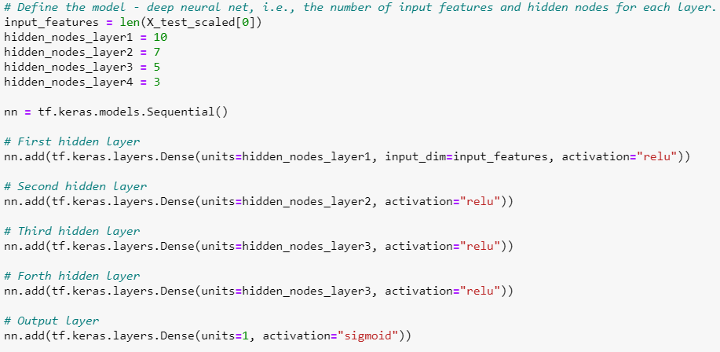
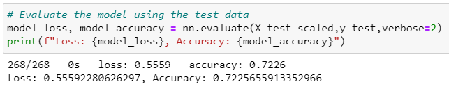

# Neural Network Charity Analysis

## Overview

The purpose of this analysis was to design a neural network that creates a binary classification system that predicts whether a charitible organization will be successful.

## Results

### Data Preprocessing

- The IS_SUCCESSFUL column is the target for the model.

- The feature variables include application type, affiliation, classification, use case, organization, status, income amount, special considerations, and ask amount. 

- The EIN and Name columns are neither targets nor features and were removed. 

### Compiling, Training, and Evaluating the Model

While I tested many different combinations of numbers of layers, neurons, and activation functions, the neural network in the optimization ipynb file in this repository has 4 layers with 10, 7, 5, and 3 neurons (respectively). It uses the relu activation function for the hidden layers and sigmoid activation function for the output layer.

Unfortunately, this model falls short of achieving the 75% target model performance.

In attempts to increase model performance, I tried the following:
- Added 2 additional layers and tried different combinations of neuron numbers on each layer
- Switched the activation functions to sigmoid and tanh, also tried different combinations of functions
- Performed data exploration to see if variables appeared to contribute to success and tested the following:
	- Different binning cutoffs for application type and classification
	- Binning of affiliation, use case, and organization
	- Removing status, special consideration, and ask amount columns.

## Summary

Most the models I ran performed at about 72-73% accuracy and did not achieve the 75% target. Moving forward, I would reccommend trying a Random Forest model and looking at the feature importance rankings, then possibly revisiting the preprocessing step and modifying which factors to include in the model.